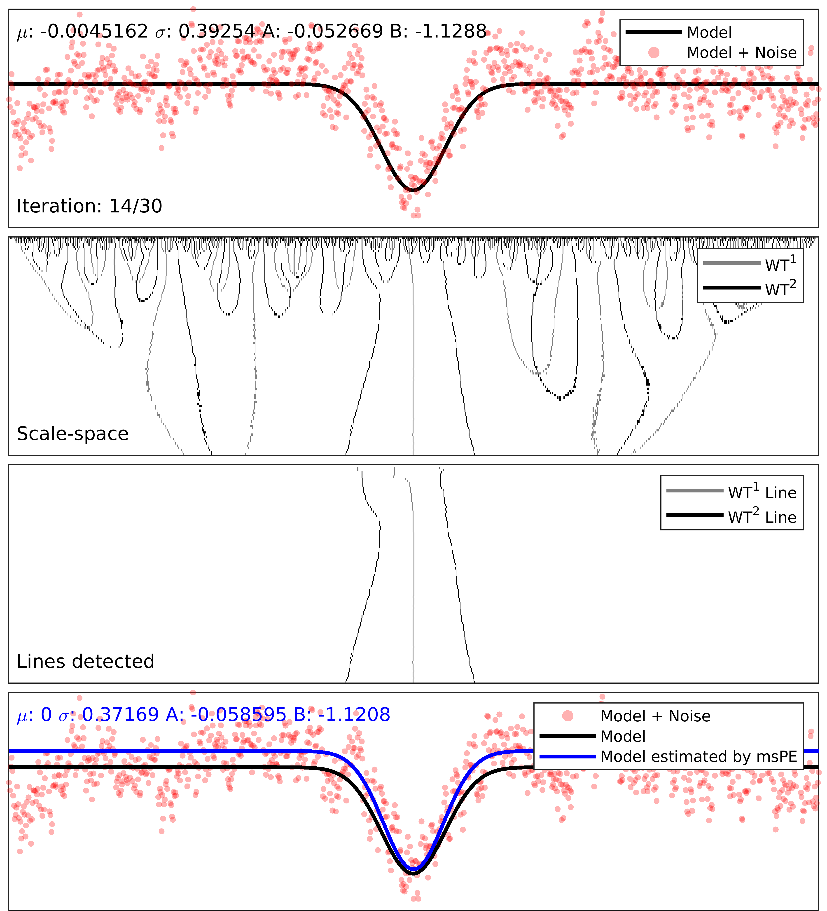
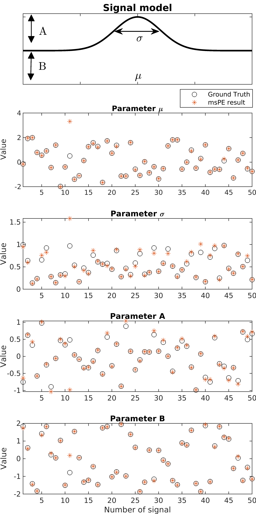
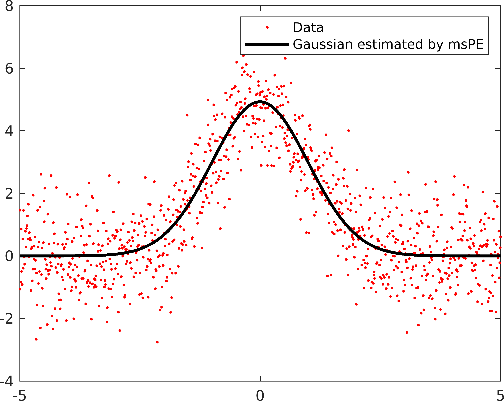

# msPE

Do you need a robust method for parameter estimation of Gaussians within MATLAB? *You have come to the right place!*

> This algorithm demonstrates the fundamentals of multiscale 
> parameter estimation (msPE) by using it for estimation of
> the parameters of noisy Gaussians signals. All parameters 
> of the Gaussian are computed from algebraic expressions.
> As demonstrated in the articles given below, even better
> parameter estimates can be achieved my means of a simple
> multivariate optimization, where msPE results serve as
> starting values.

> msPE can be applied to real-life signals effortlessly with
> only a small number of open parameters. As Gaussian functions
> appear in many contexts in science and engineering, there are
> many potential applications. The processing of electrocardiography
> (ECG) signals has already been conducted sucessfully .


### Demo


### Information on msPE

 [M. Kukuk and N. Spicher, "Parameter Estimation Based on Scale-Dependent Algebraic Expressions and  Scale-Space Fitting" in IEEE Transactions on Signal Processing, vol. 67, no. 6, pp. 1431-1446, 2019.](http://dx.doi.org/10.1109/tsp.2018.2887190) *Open Access*

 [N. Spicher and M. Kukuk, "Delineation of Electrocardiograms Using Multiscale Parameter Estimation" in IEEE Journal of Biomedical and Health Informatics (2020, accepted).](http://dx.doi.org/10.1109/JBHI.2019.2963786) *Open Access*

### Information on implementation
This algorithm was tested using MATLAB R2018b and R2019b on Linux and MacOS. The only dependency is the Wavelet Toolbox from which we use the `cwt()` command. Additionally, we use the [tight_subplot()](https://de.mathworks.com/matlabcentral/fileexchange/27991-tight_subplot-nh-nw-gap-marg_h-marg_w) script by P. Kumpulainen for visualizations and the [crossing()](https://de.mathworks.com/matlabcentral/fileexchange/2432-crossing) script by S. Brueckner for zero-crossing detection. 

## Howto

Start the file `run_me.m` from within MATLAB. Here you can define the signals to be processed. Available options are:

* Number of Gaussian signals
* Selection of Gaussian parameters
  * Linearly increasing
  * Random
* Type of noise
  * Normally distributed noise
  * Uniformly distributed noise
  * Correlated (pink) noise
* Signal-to-noise ratio [dB]

Subsequently, the algorithm processes each signal using msPE (shown here: Gaussian signal corrupted by pink noise)



After processing each signal, a summary is given. Individual results can be opened by clicking the respective index.



## Customization
If you want to customize msPE to your signals, we provide `quickstart.m` which provides a starting point in only 30 lines 
of code. Just replace the Gaussian signal with your own.

```matlab
clear all; close all; format('compact');
addpath("scripts/");
addpath("external scripts/");

% create a Gaussian
t = [-5:0.01:5];                                      % time axis
A = 5;                                                % amplitude
B = 0;                                                % baseline level
sigma = 1;                                            % width
mu = 0;                                               % shift on time axis
signal = B + A .* exp(-((t-mu).^2 / (2*sigma.^2)));   % Gaussian
signal = signal + randn(size(signal));                % Add noise

% apply it to msPE
[res, ~, ~] = mspe(signal, t, 256);                   % 256 = number scales

% average results over all scales;
A_mspe = median(res.A_mspe(:), 'omitnan');
B_mspe = median(res.B_mspe(:), 'omitnan');
sigma_mspe = median(res.sigma_mspe(:), 'omitnan');
mu_mspe = median(res.mu_mspe(:), 'omitnan');

% generate signal with parameters from msPE
signal_mspe = B_mspe + A_mspe .* exp(-((t-mu_mspe).^2 / (2*sigma_mspe.^2)));

% show results
figure; hold on; box on;
plot(t, signal, 'r.');
plot(t, signal_mspe, 'Color', 'k', 'LineWidth', 2);
legend('Data', 'Gaussian estimated by msPE');
```



## Citation

```
@ARTICLE{8579214,
  author={M. {Kukuk} and N. {Spicher}},
  journal={IEEE Transactions on Signal Processing}, 
  title={Parameter Estimation Based on Scale-Dependent Algebraic Expressions and Scale-Space Fitting}, 
  year={2019},
  volume={67},
  number={6},
  pages={1431-1446}}
```

## Contact

**Nicolai Spicher** [(Website)](https://www.plri.de/team/nicolai-spicher)

Peter L. Reichertz Institute for Medical Informatics

Technical University of Braunschweig

**Prof. Dr. Markus Kukuk** [(Website)](https://www.fh-dortmund.de/de/fb/4/personen/lehr/kukuk/index.php)

Department of Computer Science

University of Applied Sciences and Arts Dortmund
